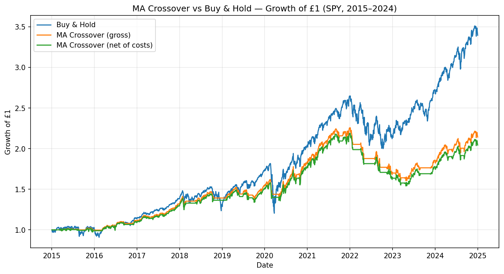

# Moving-Average Crossover Backtest (SPY, 2015–2024)

A backtest of a 20/50-day moving-average crossover strategy on SPY, benchmarked against buy-and-hold, built in Python with pandas and matplotlib.

The aim wasn't just to see whether the strategy "worked" — it was to test it *honestly*: with realistic transaction costs, no lookahead bias, and an explicit account of what the result does and doesn't show.

## What it does

- Pulls ~10 years of daily adjusted prices via `yfinance` (adjusted, so dividends and splits don't create fake jumps).
- Computes a **20-day and 50-day moving average** and goes long when the short MA is above the long MA, flat otherwise.
- **Lags the signal by one day** (`.shift(1)`) before applying it to returns — the single most important step, since the signal comes from a day's *closing* price, which you couldn't have acted on until the day was over. Skipping this is lookahead bias, and it makes broken strategies look brilliant.
- Evaluates the strategy on the same three metrics used in my QuantHack competition: **total return, Sharpe ratio** (annualised by √252, since volatility scales with the square root of time) **and maximum drawdown**.
- Charges **0.1% per trade** to reflect real-world friction, and benchmarks everything against simply buying and holding SPY.

## Results

| Metric | MA Crossover | Buy & Hold |
|---|---|---|
| Total return (gross) | +114% | +240% |
| Total return (net of costs) | +104% | +240% |
| Sharpe (gross / net) | 0.73 / 0.69 | 0.78 |
| Max drawdown | −28.9% | −33.7% |
| Number of trades | 47 | 1 |

## What I found

- **Buy-and-hold won on return, by a lot** (+240% vs +104% net). Expected: 2015–2024 was a strong bull market, and the crossover spends real time *out* of the market, so every flat day is missed upside.
- **On a risk-adjusted basis the gap nearly closed** (Sharpe 0.69 vs 0.78) — the strategy gave up return and risk in roughly equal measure. It's a lower-return, lower-risk profile, not simply a worse one.
- **The crossover won on drawdown** (−28.9% vs −33.7%), because exiting downtrends let it step aside for part of the 2020 and 2022 falls. This is visible as the flatter stretches in the equity curve.
- **Costs mattered.** 0.1% per trade cut the strategy's return by ~10 percentage points; buy-and-hold, trading once, was untouched. The more a strategy leans on turnover, the more costs erode it.

## The honest takeaway

The crossover **reliably reduces drawdown** by exiting downtrends, but it does **not reliably add return** — the clean "sell high, rebuy low" cycles are offset by whipsaws (dips that flip the signal then immediately recover) and time spent flat in a rising market. Trend-following tends to shine in bear markets or high-volatility regimes; 2015–2024 was close to the worst decade to test one. A Sharpe in the 0.7 range (rather than an implausible 3 or 4) is quiet evidence the lag is working and nothing is peeking at the future.

## Limitations

- Single asset (SPY) and a single parameter pair (20/50) — no optimisation, deliberately, since tuning on the same data you test on is its own form of lookahead.
- Long/flat only, no shorting.
- Flat transaction cost; no slippage that scales with trade size, and no interest earned on cash while flat.
- One historical period — results are regime-dependent and would differ in a bear market.

## Stack

Python · pandas · numpy · matplotlib · yfinance
